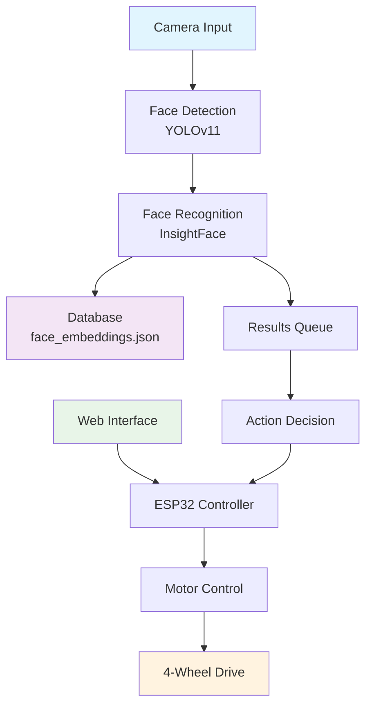

# 🚗🔍 Smart Face Recognition Car

<div align="center">


*An intelligent robotic car that combines real-time face recognition with remote control capabilities*

[🎥 Demo](#demo) • [🚀 Features](#features) • [⚙️ Setup](#installation) • [📖 Usage](#usage) • [🤝 Contributing](#contributing)

</div>

---

## 📋 Table of Contents

- [🎯 Overview](#overview)
- [✨ Features](#features)
- [🏗️ Architecture](#architecture)
- [🛠️ Hardware Requirements](#hardware-requirements)
- [💻 Software Requirements](#software-requirements)
- [⚙️ Installation](#installation)
- [🎮 Usage](#usage)
- [🔧 Configuration](#configuration)
- [📡 Web Interface](#web-interface)
- [🤖 Face Recognition](#face-recognition)
- [🔗 API Reference](#api-reference)
- [🐛 Troubleshooting](#troubleshooting)
- [🤝 Contributing](#contributing)
- [📄 License](#license)

---

## 🎯 Overview

The **Smart Face Recognition Car** is an innovative IoT project that combines:
- 🤖 **Real-time face detection and recognition** using YOLO and InsightFace
- 🚗 **Remote-controlled robotic car** with ESP32 microcontroller
- 🌐 **Web-based control interface** for manual navigation
- 📊 **Intelligent person tracking** and unknown face logging
- 🔄 **Multi-threaded processing** for optimal performance

Perfect for security applications, autonomous navigation research, and educational robotics projects!

---

## ✨ Features

### 🔍 Face Recognition System
- **Advanced Face Detection**: YOLOv11 model for accurate face detection
- **Face Recognition**: InsightFace for high-precision face matching
- **Real-time Processing**: Multi-threaded architecture for smooth performance
- **Unknown Face Logging**: Automatic capture and storage of unrecognized faces
- **Configurable Thresholds**: Adjustable confidence and similarity parameters

### 🚗 Smart Car Control
- **WiFi Remote Control**: Web-based interface for manual driving
- **Omnidirectional Movement**: Forward, backward, left, right, and diagonal movement
- **Real-time WebSocket Communication**: Instant response to control commands
- **Motor Direction Correction**: Automatic compensation for motor variations
- **Individual Motor Testing**: Built-in diagnostics for motor calibration

### 🌐 Web Interface
- **Responsive Design**: Touch-friendly controls for mobile devices
- **Real-time Controls**: WebSocket-based instant command transmission
- **Visual Feedback**: Intuitive arrow-based navigation interface
- **Connection Monitoring**: Automatic reconnection on disconnection

---

## 🏗️ Architecture



---

## 🛠️ Hardware Requirements

### Essential Components
| Component | Specification | Quantity |
|-----------|---------------|----------|
| **ESP32 Development Board** | WiFi + Bluetooth | 1 |
| **DC Motors** | 12V Gear Motors | 4 |
| **Motor Driver** | L298N or similar | 2 |
| **Chassis** | 4WD Robot Car Kit | 1 |
| **Power Supply** | 12V Battery Pack | 1 |
| **Camera** | USB Webcam or CSI Camera | 1 |
| **Jumper Wires** | Male-to-Male/Female | 20+ |

### Optional Components
- LED indicators for status
- Ultrasonic sensor for obstacle detection
- Servo motor for camera pan/tilt

---

## 💻 Software Requirements

### Python Dependencies
```bash
# Core Libraries
opencv-python>=4.8.0
numpy>=1.21.0
insightface>=0.7.3
ultralytics>=8.0.0

# Configuration & Threading
pyyaml>=6.0
threading
queue
```

### ESP32 Libraries
```cpp
// Required Arduino Libraries
#include <WiFi.h>
#include <ESPAsyncWebServer.h>
#include <AsyncTCP.h>
```

---

## ⚙️ Installation

### 1. Clone the Repository
```bash
git clone https://github.com/yourusername/smart-face-recognition-car.git
cd smart-face-recognition-car
```

### 2. Set Up Python Environment
```bash
# Create virtual environment
python -m venv venv
source venv/bin/activate  # On Windows: venv\Scripts\activate

# Install dependencies
pip install -r requirements.txt
```

### 3. Download Models
```bash
# YOLOv11 Face Detection Model
wget https://github.com/ultralytics/assets/releases/download/v0.0.0/yolov11m-face.pt

# InsightFace models will be downloaded automatically on first run
```

### 4. Configure Environment
```bash
# Copy environment template
cp .env.example .env

# Edit configuration
nano .env  # Update WiFi credentials and paths
```

### 5. Upload ESP32 Code
1. Open `smart_car.cpp` in Arduino IDE or PlatformIO
2. Install required libraries (WiFi, ESPAsyncWebServer, AsyncTCP)
3. Update WiFi credentials in the code
4. Upload to ESP32 board

---

## 🎮 Usage

### Starting the Face Recognition System
```bash
# Navigate to project directory
cd smart-face-recognition-car

# Activate virtual environment
source venv/bin/activate  # On Windows: venv\Scripts\activate

# Run the main application
python main.py
```

### Accessing the Car Control Interface
1. **Power on the ESP32 car**
2. **Connect to WiFi network**: `MyWiFiCar` (password: `12345678`)
3. **Open web browser** and navigate to: `http://192.168.4.1`
4. **Use touch controls** to drive the car

### System Workflow
```
🔄 Camera Capture → 🔍 Face Detection → 🧠 Recognition → 📊 Action Decision → 🚗 Car Control
```

---

## 🔧 Configuration

### Face Detection Settings (`config.yaml`)
```yaml
face_detection:
  model_path: "yolov11m-face.pt"
  confidence_threshold: 0.6  # Adjust sensitivity
  min_face_size: 100        # Minimum detectable face size
```

### Face Recognition Settings
```yaml
face_recognition:
  similarity_threshold: 0.40  # Recognition sensitivity
  embedding_size: 512        # Feature vector dimension
```

### Camera Configuration
```yaml
camera:
  device_id: 0      # Camera index
  resolution:
    width: 1280     # Frame width
    height: 720     # Frame height
  fps: 30          # Frames per second
```

---

## 📡 Web Interface

### Control Commands
| Button | Action | Command |
|--------|--------|---------|
| ⬆️ | Forward | `1` |
| ⬇️ | Backward | `2` |
| ⬅️ | Strafe Left | `3` |
| ➡️ | Strafe Right | `4` |
| ↖️ | Forward Left | `5` |
| ↗️ | Forward Right | `6` |
| ↙️ | Backward Left | `7` |
| ↘️ | Backward Right | `8` |
| 🔄 | Turn Left | `9` |
| 🔁 | Turn Right | `10` |
| ⏹️ | Stop | `0` |

### WebSocket Protocol
```javascript
// Connect to car
const websocket = new WebSocket("ws://192.168.4.1/ws");

// Send movement command
websocket.send("1");  // Move forward
```

---

## 🤖 Face Recognition

### Database Structure
```json
{
  "person_name": {
    "embedding": [512-dimensional vector],
    "metadata": {
      "added_date": "2025-01-01",
      "last_seen": "2025-01-01 12:00:00",
      "confidence": 0.95
    }
  }
}
```

### Adding New Faces
1. **Capture**: Place face in camera view
2. **Detection**: System automatically detects faces
3. **Recognition**: Unknown faces are saved to `unknown_faces/`
4. **Registration**: Manually move images to `Face_imagers/` and update database

### Recognition Workflow
```python
# Simplified recognition process
face_detected → extract_embedding → compare_with_database → classify_person
```

---

## 🐛 Troubleshooting

### Common Issues

#### Face Recognition Not Working
```bash
# Check camera connection
python -c "import cv2; cap = cv2.VideoCapture(0); print('Camera OK' if cap.read()[0] else 'Camera Error')"

# Verify model files
ls -la yolov11m-face.pt insightface_models/
```

#### Car Not Responding
1. **Check ESP32 power** and LED indicators
2. **Verify WiFi connection** to `MyWiFiCar` network
3. **Test WebSocket connection** in browser console
4. **Check motor wiring** and direction corrections

#### Performance Issues
```yaml
# Reduce resolution for better performance
camera:
  resolution:
    width: 640   # Lower resolution
    height: 480
  fps: 15       # Reduce frame rate
```

### Debug Mode
```bash
# Enable verbose logging
export DEBUG_MODE=true
python main.py
```

---

## 🤝 Contributing

We welcome contributions! Please follow these steps:

1. **Fork** the repository
2. **Create** a feature branch (`git checkout -b feature/amazing-feature`)
3. **Commit** your changes (`git commit -m 'Add amazing feature'`)
4. **Push** to the branch (`git push origin feature/amazing-feature`)
5. **Open** a Pull Request

### Development Setup
```bash
# Install development dependencies
pip install -r requirements-dev.txt

# Run tests
python -m pytest tests/

# Format code
black . && isort .
```

---

## 📄 License

This project is licensed under the **MIT License** - see the [LICENSE](LICENSE) file for details.

---

## 🏆 Acknowledgments

- **YOLOv11** by Ultralytics for face detection
- **InsightFace** for face recognition algorithms
- **ESP32** community for IoT development resources
- **OpenCV** for computer vision capabilities

---

<div align="center">

### 🌟 Star this project if you found it helpful!

[](https://github.com/yourusername/smart-face-recognition-car/stargazers)
[](https://github.com/yourusername/smart-face-recognition-car/network/members)

**Made with ❤️ for the robotics and AI community**

</div>
